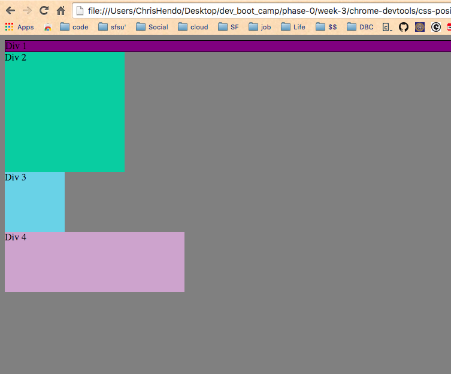

#How can you use Chrome's DevTools inspector to help you format or position elements?#

Well, first of all you can see an overview/diagram of what and where your css is affected. 

#How can you resize elements on the DOM using CSS?#

You can resize with .px or .em 

#What are the differences between absolute, fixed, static, and relative positioning? Which did you find easiest to use? Which was most difficult?#

Static. This is the default for every single page element. 

Relative. What this type of positioning really means is "relative to itself."

Absolute. This is a very powerful type of positioning that allows you to literally place any page element exactly where you want it. You use the positioning attributes top, left bottom and right to set the location. 

Fixed. This type of positioning is fairly rare but certainly has its uses. A fixed position element is positioned relative to the viewport, or the browser window itself. The viewport doesn't change when the window is scrolled, so a fixed positioned element will stay right where it is when the page is scrolled, creating an effect a bit like the old school "frames" days.

#What are the differences between margin, border, and padding?#

Margin is applied to the outside of you element hence effecting how far your element is away from other elements.

Padding is applied to the inside of your element hence effecting how far your element's content is away from the border.

Also, using margin will not affect your element's dimensions whereas padding will make your elements dimensions (set height + padding) so for example if you have a 100x100px div with a 5 px padding, your div will actually be 105x105px

#What was your impression of this challenge overall? (love, hate, and why?)#

I didnt get through all of it due to time, but I am definitely coming back to finish. I did like it. Chrome Dev Tools is cool.   kxjo
